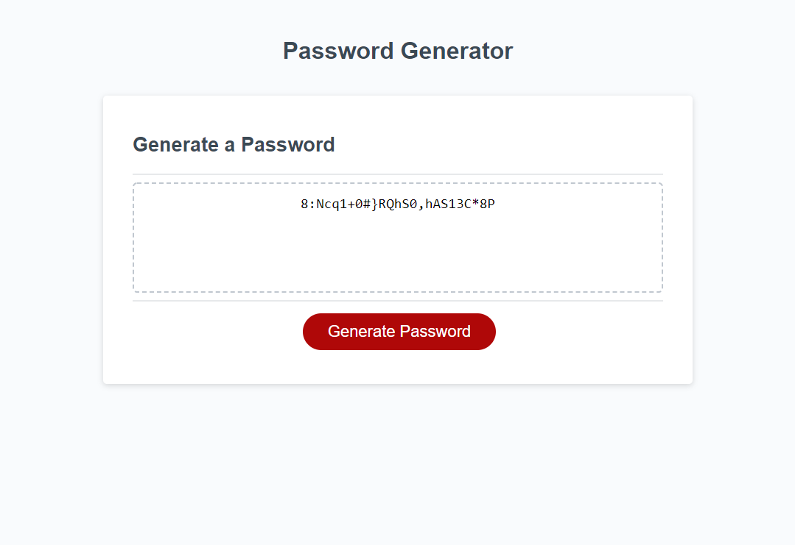

# password-generator
Challenge 3: Javascript Password Generator

## Summary:
Create a javascript file that will saatisfy these requirements:
GIVEN I need a new, secure password
WHEN I click the button to generate a password
THEN I am presented with a series of prompts for password criteria
WHEN prompted for password criteria
THEN I select which criteria to include in the password
WHEN prompted for the length of the password
THEN I choose a length of at least 8 characters and no more than 128 characters
WHEN asked for character types to include in the password
THEN I confirm whether or not to include lowercase, uppercase, numeric, and/or special characters
WHEN I answer each prompt
THEN my input should be validated and at least one character type should be selected
WHEN all prompts are answered
THEN a password is generated that matches the selected criteria
WHEN the password is generated
THEN the password is either displayed in an alert or written to the page.

## How to do this:

### Create a function to set length:
This function must accomplish two main objectives:
1.) Ask the user the desired length of password.
2.) When the user gives input, ensure that it is within the correct length and type requirements.

If the  input is incorrect or unusable, the funciton must rerun.

### Create a function to set criteria:
This function must ask, using a series of window alerts, which criteria and types shll be included in the password. Then followning the prompts, must confirm the selections are correct. If no criteria (text types) are selected, then notify the user that at least one must be selected, and rerun this function until the appropriate input is given.

### Use the results of the previous two functions to generate a random password:
The length given will set the number of times a for loop adds a random character to the password.
    -We cannot use a single string containing all viable characters, because the number of characters in each type is unequal, therefore the tendancy to select one type more would be a problem.

In order to solve this an array of types was created, and a random number was then used to select the type.

After the type was selected, a random character of that type was selected and added to the password string. 
    -One bug that came with this was that we could not set the initial password to "" because this returned an undefined error when trying to add to it, so it is initialized to the string "empty", then the last step before returning the password to the user, is to remove the first 5 characters.

## Results

Here you can see the program generating a 20 character randomized password using; capital letters, lowercase letters, numbers, and special characters.

Repository can be accessed here: [Random password generator repository](https://github.com/ecarlson0123/password-generator)

Deployed website can be accessed here: [Random password generator website]()